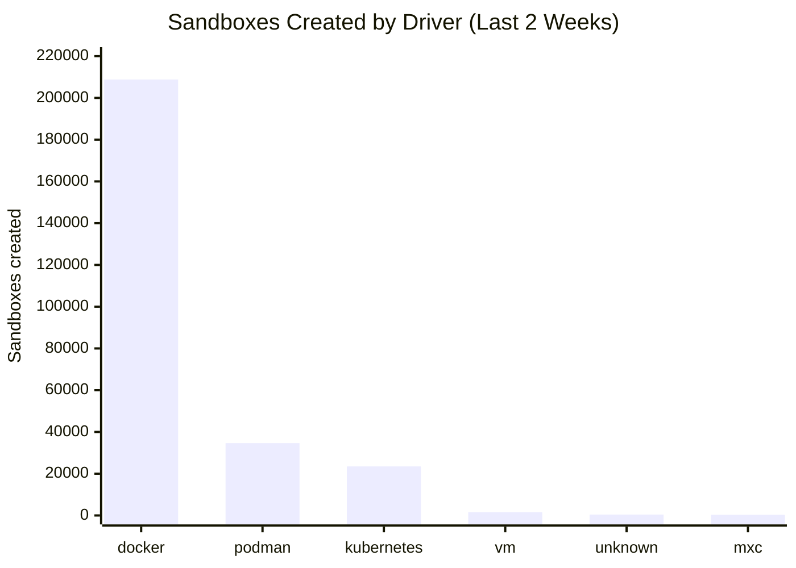
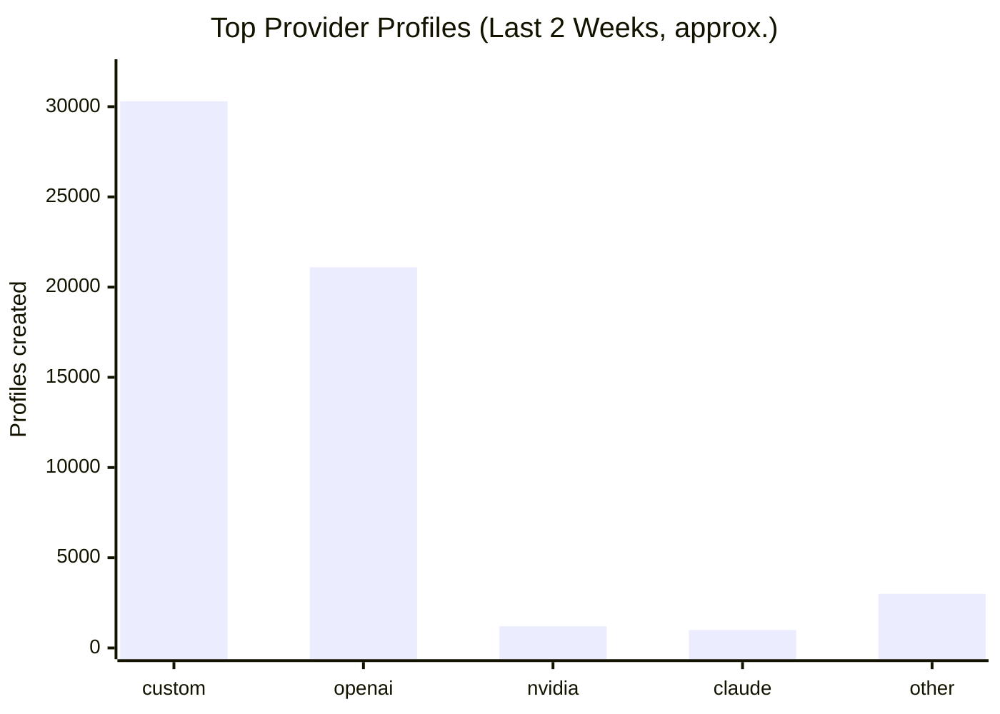
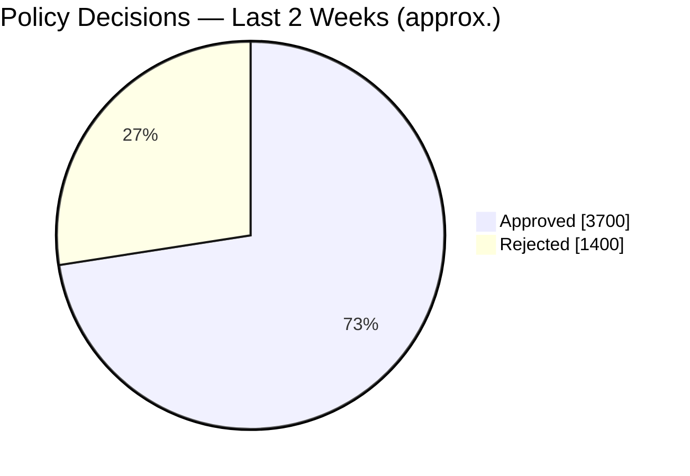

# OpenShell Community Telemetry Reports

OpenShell collects anonymous, aggregate usage telemetry (see the [Telemetry section](../README.md#telemetry) of the main README for what's collected and how to opt out). We publish a summary of the trends here every two weeks so the community can see how the project is being used.

Telemetry collection landed in [#1433](https://github.com/NVIDIA/OpenShell/pull/1433) on **June 1, 2026**, so all "All-time" figures are cumulative from that date.

Numbers are aggregate counts only — no user data, code, prompts, or command contents are collected. Reports are listed newest first.

---

## Update — July 8, 2026

First public telemetry update. The **Last 2 weeks** column covers the trailing two-week window; **All-time** is cumulative since telemetry landed on June 1, 2026 (~5 weeks). A large share of all-time activity falls within this first two-week window.

| Metric | Last 2 weeks | All-time |
|---|---:|---:|
| Sandboxes created | 269,220 | 383,224 |
| Sandboxes deleted | 247,727 | 343,216 |
| Sandbox creation failures | 5,345 | 12,822 |
| Actions denied | 2,323,468 | 3,861,935 |
| Network activity events | 29,935,431 | 43,079,862 |

Creation failure rate held around 2% over the last two weeks (~3% all-time).

**Sandbox drivers (last 2 weeks).** Docker dominates at 208,816, followed by Podman (34,637) and Kubernetes (23,480). VM (1,562), unknown (422), and MXC (303) make up the long tail. All-time we've also seen a handful of apple-container and macos sandboxes.

**Where sandboxes are created (last 2 weeks).** The United States leads by a wide margin, followed by Israel, Australia, Hong Kong, India, Singapore, South Korea, Germany, Japan, and China.

**Providers (last 2 weeks).** `custom` profiles lead (~30k), then `openai` (~21k), with nvidia, claude, anthropic, github, gitlab, opencode, codex, and copilot trailing.

**Policy.** Roughly 73% of policy decisions were approved over the last two weeks. Of denied sandbox connections, ~99% fell under the "Connect Policy" deny group, with "Bypass" denials near zero.

Next update: ~July 22, 2026.
